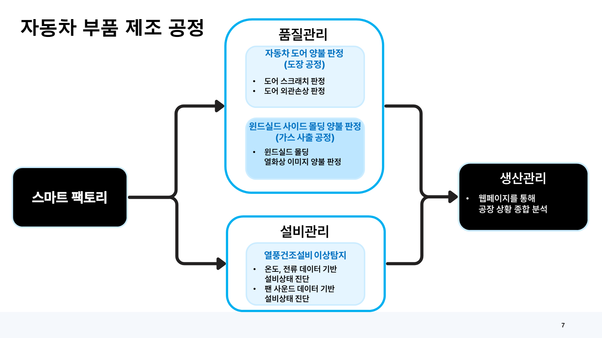
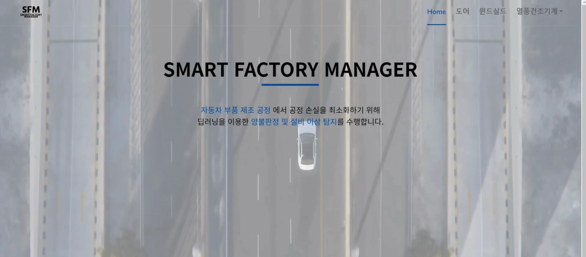
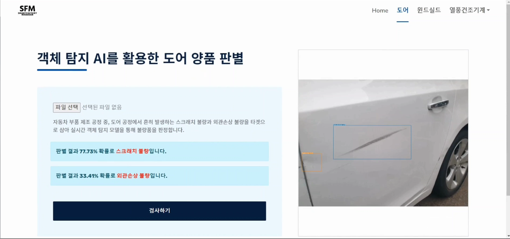
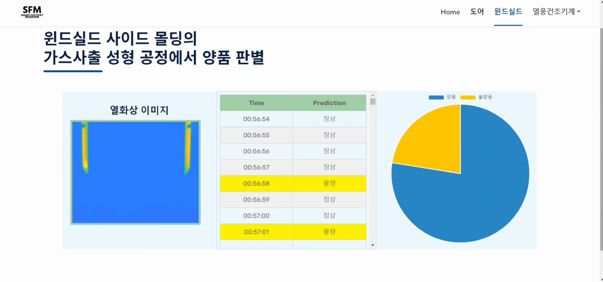
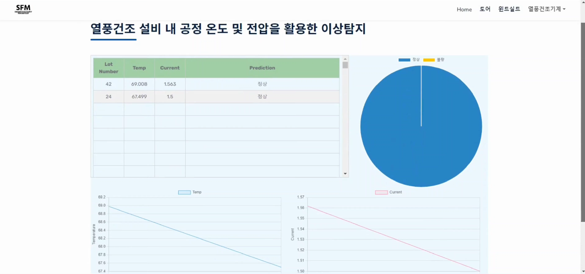
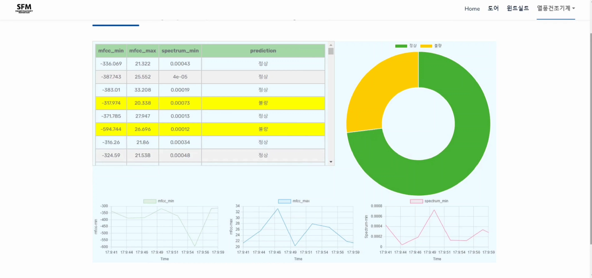

# Smart Factory Manager

- 디지털스마트부산 오전반 3조 SFM의 최종 프로젝트입니다.

# 주제

- 자동차 부품 제조 공정에서 AI를 활용한 양불판정과 예지보전

1. 도어 양품 판별
2. 윈드쉴드 사이드 몰딩 양품 판별
3. 열풍건조 설비 이상탐지

# 자동차 부품 제조 공정

# 구현 화면

- 메인 페이지
  

- 도어 양품 판별
  

- 윈드쉴드 사이드 몰딩의 가스 사출 성형 공정에서 양품 반펼
  

- 차제 강판 도금 공정에서 열풍 건조 설비 이상 탐지
  

